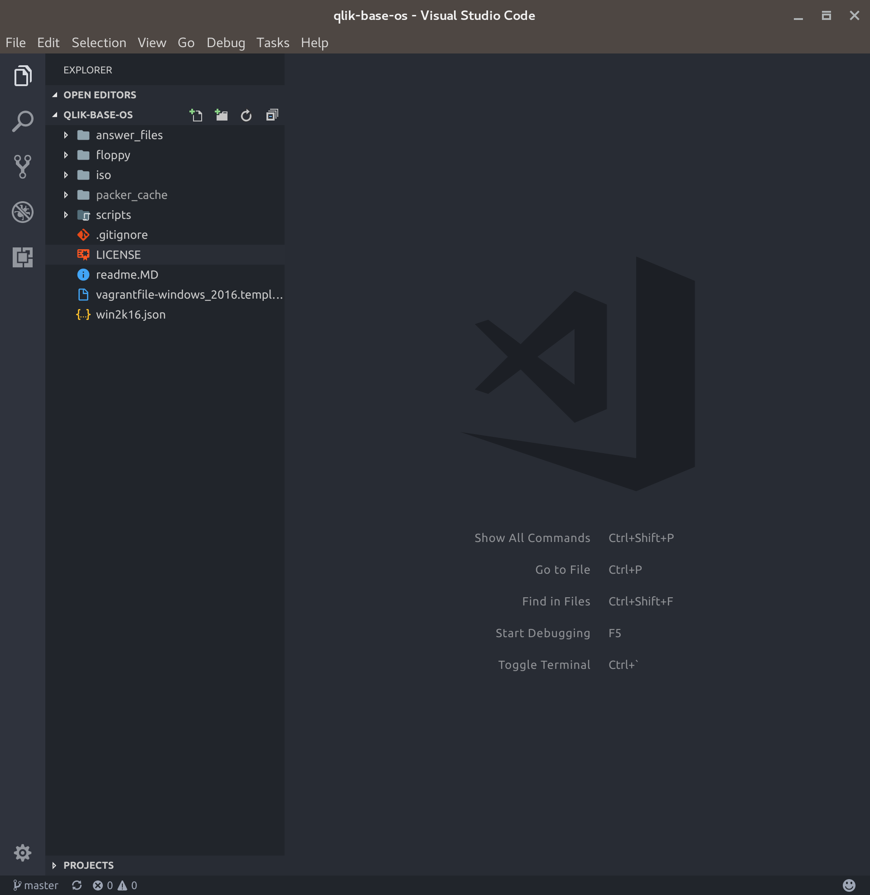
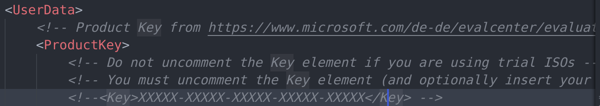
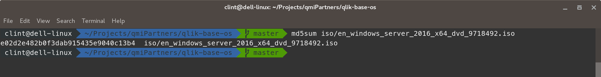
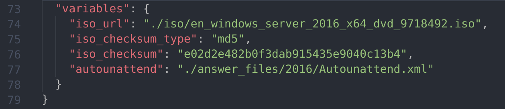

# Building the base machine image

## Updating the Windows 2016 License information
1. Launch your text editor and open the qlik-base-os repository folder.

* Open the Autounattend.xml file located in /answer_files/2016
* It is recommended that you enter a valid Windows 2016 Server Standard edition license key (however it is possible to use an Evaluation version of Windows.  If an evaluation version is to be used skip this step. 
* Search for __ProductKey__

* Uncomment the key field and change the X's to be your license key
* Save the file

## Get the MD5 checksum value from the Windows 2016 ISO file
You will need to download a tool for this, use something like MD5SUM or if using Windows the [MD5 Checksum Tool](https://www.microsoft.com/en-au/download/details.aspx?id=11533)

1. Launch your terminal
* Use whatever MD5 checksum tool you have chosen to get the checksum

* Copy the checksum value into your clipboard

## Update the checksum value and the name of your Windows iso file
1. From your text editor open the file /qlik-base-os/win2k16.json
* Scroll to the bottom and find the variables section

* Update the iso file name in __iso_url__
* Update the iso checksum in __iso_checksum__
* Save the file

## Start the build
1. Launch your terminal
* Browse to /qlik-base-os 
* Enter __packer build win2k16.json__
* Wait
* To view the process open VirtualBox and launch the VM, you will see it progress through the various steps
* A file will be output at the end which is the Box file to be used in Vagrant 