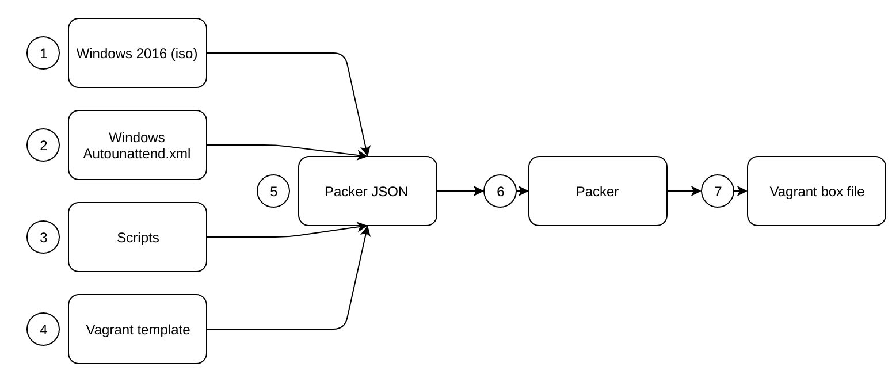

# Introduction

Packer is an open source tool for creating identical machine images for multiple platforms from a single source configuration. Packer is lightweight, runs on every major operating system, and is highly performant, creating machine images for multiple platforms in parallel. 

QMI uses Hashicorp Vagrant to use the machine image created by Packer.

These images are known as "boxes" in Vagrant, and specifying the box to use for your Vagrant environment is always the first step after creating a new Vagrantfile.  Box files are generated through another Hashicorp tool called Packer, and boxes can be created for most HyperVisors.  As QMI is VirtualBox focussed that will be the focus of this article.

## What you will need

* The latest version of Packer 
* A Windows Server 2016 ISO (This can be the evaluation edition),(The provided scripts are designed to work with Standard edition)
* A decent text editor
* <a href="https://github.com/Qlik-Partner-Tools/qlik-base-os" target="_blank">Base Operating System</a> repository
* Some knowledge about Packer, JSON and PowerShell
* Time, building a box takes hours

## qlik-base-os repository
The qlik-base-os repository contains the files necessary to create a blank Microsoft Windows 2016 Standard Oracle VirtualBox virtual machine.  

| Folder | File | Description|
|--------|------|------------|
| answer_files| Autounattend.xml| Windows unattended install template|
| floppy | NA | Not currently used|
| iso | NA | Place the Windows 2016 iso download here|
| scripts | All | Scripts that are executed during the creation of the virtual machine image |
| root | vagrantfile-windows_2016.template | Vagrant file used to create the Vagrant box file |
| root | Win2k16.json | Packer configuration file |

## Packer Worklow

| Step | Description |
|------|-------------|
|1| Windows 2016 iso file is used by the win2k16.json (Packer template)|
|2| A standard Windows Autounattend.xml file is used to configure and install Windows 2016 Server|
|3| Scripts are executed by Packer and referenced by the win2k16.json file to determine what is created with the machine image |
|4| The vagrant template specifies the default values to c reate as the output machine image (eg. Amount of RAM/Cores)
|5| The above files are used by the Packer JSON file (win2k16.json) to create the machine image
|6| Hashicorp Packer does all the lifting and outputs a Vagrant box file
|7| The output of packer is a Vagrant box (this will be added to Vagrant and be used as the base operating system) 