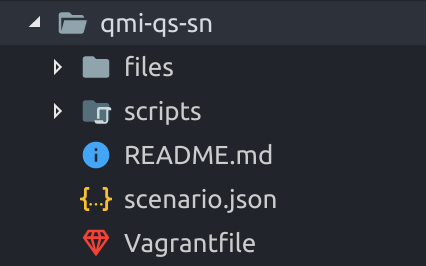

# What makes a scenario

### Folder Structure
QMI has been built to a set of standards to enable fast and efficient usage and creation of scenarios.  A scenarios folder structure should follow this standard.

### Scenario Folder Name
This is the parent folder containing the scenario content.

[Scenario.json](scenario-json.md)

[Vagrantfile](vagrantfile.md)

[Readme.md](readme-md.md)

[Scripts](scripts.md)

[Files Folder](files.md)

