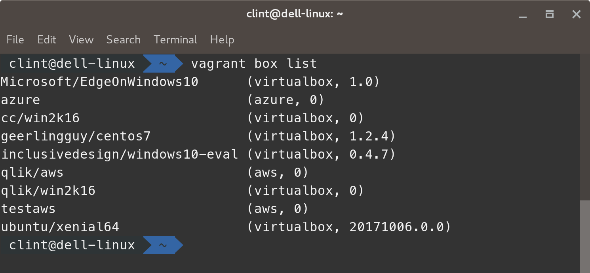
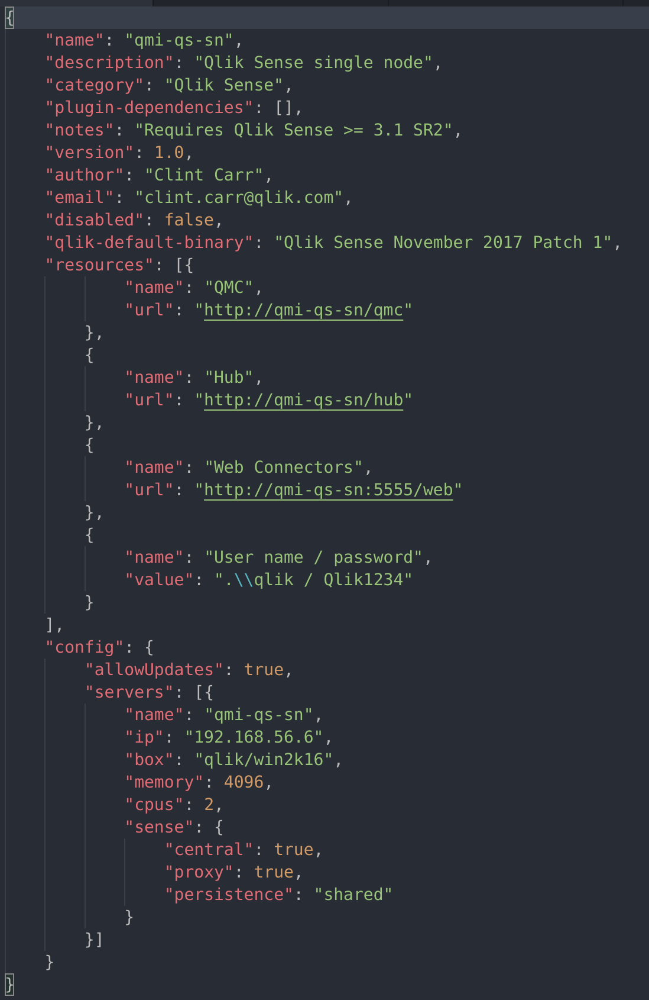
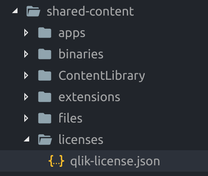

# Getting Started

## Add the Vagrant box to Vagrant
1. Launch your terminal or PowerShell if using Microsoft Windows
* Browse to /qlik-base-os/
* Find the file __Win2k16-virtualbox.box__ this is the output of building the base image from Packer
* Enter __vagrant box add --name qlik/win2k16 win2k16-virtualbox.box__
* Enter __vagrant box list__ and ensure the __qlik/win2k16__ box is present

* This matches the value in the scenario.json file in the scenario folder


## Update the Qlik Licenses
1. Launch your text editor
2. Open the folder /qmi-scenarios/
3. Open the file /shared-content/licenses/qlik-license.json

4. Add the Qlik Licenses (at this stage only sense and qlikview are functional)

   *NB:  sensepa (i.e. Professional/Analyzer)  is the default license type for Qlik Sense. To use token base the scenario must  have `"license": "token"` set in the "sense" section of the scenario.json file.*

```
{
  "sense": {
    "name": "ENTER_NAME_HERE",
    "control": "ENTER_CONTROL_CODE_HERE",
    "serial": "ENTER_SERIAL_CODE_HERE",
    "organization": "ENTER_YOUR_ORG_NAME_HERE",
    "lef": "QLIKSENSE_LEF_STRING_GOES_HERE"
  },
  "sensepa": {
    "name": "ENTER_NAME_HERE",
    "control": "ENTER_CONTROL_CODE_HERE",
    "serial": "ENTER_SERIAL_CODE_HERE",
    "organization": "ENTER_YOUR_ORG_NAME_HERE",
    "lef": "QLIKSENSE_LEF_STRING_GOES_HERE"
  },
  "qap": {
    "name": "ENTER_NAME_HERE",
    "control": "ENTER_CONTROL_CODE_HERE",
    "serial": "ENTER_SERIAL_CODE_HERE",
    "organization": "ENTER_YOUR_ORG_NAME_HERE"
  },
  "qlikview": {
    "name": "ENTER_NAME_HERE",
    "control": "ENTER_CONTROL_CODE_HERE",
    "serial": "ENTER_SERIAL_CODE_HERE",
    "organization": "ENTER_YOUR_ORG_NAME_HERE"
  },
  "datamarket": {
    "name": "ENTER_NAME_HERE",
    "control" : "ENTER_CONTROL_CODE_HERE",
    "serial": "ENTER_SERIAL_CODE_HERE",
    "termsAcceptance": {},
    "organization": "ENTER_YOUR_ORG_NAME_HERE",
    "lef": "DATAMARKET_LEF_STRING_GOES_HERE"
  }
}
```

Here is an example of the sense (token) and sensepa (professional/Analyzer) licenses populated:
```
"sense": {
    "name": "Qlik token",
    "control": "12345",
    "serial": "9999000000001299",
    "organization": "Qlik",
    "lef": "9999000000001292\nPURPOSE;2001 Sense Token Key;;\nPRODUCTLEVEL;50;;2020-01-31\nTOKENS;100;;\nOVERAGE;NO;;\nTIMELIMIT;;;2020-01-31\nZ8D9-SZYD-J5RR-D86G-ABCD"
  },
  "sensepa": {
    "name": "Qlik  Professional Analyser",
    "control": "12345",
    "serial": "9999000000001200",
    "organization": "Qlik",
    "lef": "9999000000001277\nPURPOSE;2001 Sense P/A Key;;\nPRODUCTLEVEL;50;;2020-01-31\nTIMELIMIT;;;2020-01-31\nOVERAGE;NO;;\nPROFESSIONAL;100;;\nANALYZER;100;;\nGEOANALYTICS;YES;;\nGEOPLUS;YES;;\nGEOCODING;1000000;2018-12-31;2020-01-31\nWEBCONNECTORS;YES;;\nQDM_ESSENTIALS;YES;;\nIGNORE_TOKENS;YES;;\nTOKENS;200;;\nELASTIC;NO;;\nCLOUD_SERVICE;NO;;\nKZW3-CQ8K-9E5U-L894-WXYZ"
  },
  ```

## Qlik Version
The version of Qlik that is installed with the scenario is determined by the default-qlik-binary field in __scenario.json__.  This value updates the /shared-content/binaries/qver.json file.

## Qlik Version Updates
The available versions to install are stored within /shared-content/binaries/qBinaryDownload.json.  This file needs to have the version and URL in order to download the entered version of Qlik Sense.

```
{
    "qliksense": [
        {
            "name": "Qlik Sense November 2017 Patch 1",
            "url": "https://da3hntz84uekx.cloudfront.net/QlikSense/11.24/1/_MSI/Qlik_Sense_update.exe",
            "url2": "https://da3hntz84uekx.cloudfront.net/QlikSense/11.24/0/_MSI/Qlik_Sense_setup.exe"
        },
        {
            "name": "Qlik Sense November 2017",
            "url": "https://da3hntz84uekx.cloudfront.net/QlikSense/11.24/0/_MSI/Qlik_Sense_setup.exe"
        },
        {
            "name": "Qlik Sense September 2017 Patch 1",
            "url": "https://da3hntz84uekx.cloudfront.net/QlikSense/11.14/1/_MSI/Qlik_Sense_update.exe",
            "url2": "https://da3hntz84uekx.cloudfront.net/QlikSense/11.14/0/_MSI/Qlik_Sense_setup.exe"
        },
        {
            "name": "Qlik Sense September 2017",
            "url": "https://da3hntz84uekx.cloudfront.net/QlikSense/11.14/0/_MSI/Qlik_Sense_setup.exe"
        },
        {
            "name": "Qlik Sense June 2017 Patch 3",
            "url": "https://da3hntz84uekx.cloudfront.net/QlikSense/11.11/3/_MSI/Qlik_Sense_update.exe",
            "url2": "https://da3hntz84uekx.cloudfront.net/QlikSense/11.11/0/_MSI/Qlik_Sense_setup.exe"
        },
        {
            "name": "Qlik Sense June 2017 Patch 2",
            "url": "https://da3hntz84uekx.cloudfront.net/QlikSense/11.11/2/_MSI/Qlik_Sense_update.exe",
            "url2": "https://da3hntz84uekx.cloudfront.net/QlikSense/11.11/0/_MSI/Qlik_Sense_setup.exe"
        },
        {
            "name": "Qlik Sense June 2017 Patch 1",
            "url": "https://da3hntz84uekx.cloudfront.net/QlikSense/11.11/1/_MSI/Qlik_Sense_update.exe",
            "url2": "https://da3hntz84uekx.cloudfront.net/QlikSense/11.11/0/_MSI/Qlik_Sense_setup.exe"
        },
        {
            "name": "Qlik Sense June 2017",
            "url": "https://da3hntz84uekx.cloudfront.net/QlikSense/11.11/0/_MSI/Qlik_Sense_setup.exe"
        },
        {
            "name": "Qlik Sense 3.2 SR5",
            "url": "https://da3hntz84uekx.cloudfront.net/QlikSense/3.2.5/205/_MSI/Qlik_Sense_setup.exe"
        },
        {
            "name": "Qlik Sense 3.2 SR4",
            "url": "https://da3hntz84uekx.cloudfront.net/QlikSense/3.2.4/204/_MSI/Qlik_Sense_setup.exe"
        },
        {
            "name": "Qlik Sense 3.2 SR3",
            "url": "https://da3hntz84uekx.cloudfront.net/QlikSense/3.2.3/203/_MSI/Qlik_Sense_setup.exe"
        },
        {
            "name": "Qlik Sense 3.2 SR2",
            "url": "https://da3hntz84uekx.cloudfront.net/QlikSense/3.2.2/202/_MSI/Qlik_Sense_setup.exe"
        },
        {
            "name": "Qlik Sense February 2018 pre-release",
            "preview": true,
            "url": "https://qmi.qlik.com/downloads/installers/Qlik_Sense_setup.exe"
        }
    ],
    "qlikview": [
        {
            "name": "QlikView Server November 2017",
            "url": "https://da3hntz84uekx.cloudfront.net/qlikview/12.20/122020100/_MSI/QlikViewServer_x64Setup.exe"
        },
        {
            "name": "QlikView Server 12.10 SR8",
            "url": "https://da3hntz84uekx.cloudfront.net/qlikview/12.10/121020600/_MSI/QlikViewServer_x64Setup.exe"
        },
        {
            "name": "QlikView Server 12.10 SR7",
            "url": "https://da3hntz84uekx.cloudfront.net/qlikview/12.10/121020500/_MSI/QlikViewServer_x64Setup.exe"
        },
        {
            "name": "QlikView Server 11.20 SR17",
            "url": "https://da3hntz84uekx.cloudfront.net/qlikview/11.20/13607/_MSI/QlikViewServer_Win2012andUp.exe"
        }
    ]
}
```
