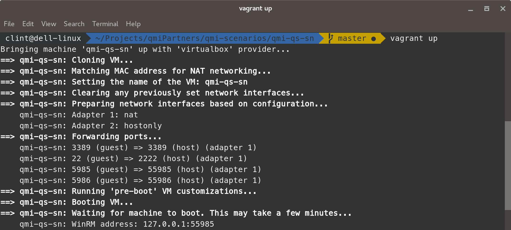
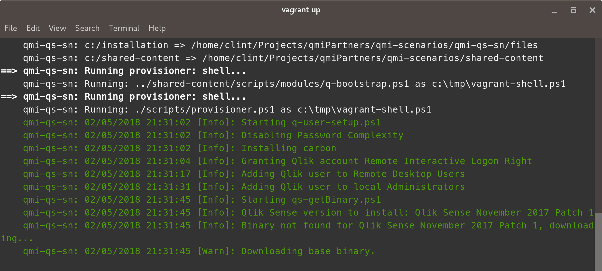

# Launching a scenario

1. Open your terminal or PowerShell if using Microsoft Windows
* Browse to the scenario you want to start (eg. /qmi-scenarios/qmi-qs-sn)
* Enter __vagrant up__

* Watch the progress (depending on machine this process should take approximately 10 minutes)
* Check for any error's or warnings during the provisioning process
